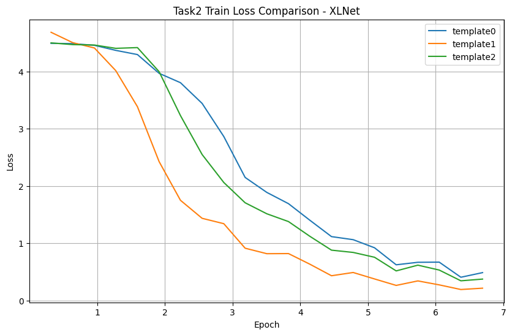

#  Commonsense Validation and Explanation  
### Fine-tuning Pre-trained Language Models with Ensemble Learning  

---

## 📝 Abstract

This project addresses commonsense reasoning in NLP via two SemEval 2020 subtasks: **Commonsense Validation (Task A)** and **Commonsense Explanation (Task B)**.

- **Task A** involves selecting the sentence that violates commonsense.
- **Task B** focuses on identifying the most plausible explanation for a nonsensical statement.

We formulate both tasks as classification problems by attaching a classification head to pre-trained language models to compute plausibility scores and select the correct answer.  
We explore three pre-trained models and apply ensemble learning to improve performance.

---

## 📌 Problem Statement

###  Task A: Commonsense Validation

In this task, the system is given two semantically similar sentences and must determine **which one violates commonsense**.

**Example**:  
- "He put a turkey into the fridge."  ✅
- "He put an elephant into the fridge."

The second sentence is unreasonable because it violates physical commonsense.  
Our goal is to equip large language models (LLMs) with the ability to **distinguish unreasonable statements**.

---

###  Task B: Commonsense Explanation

In this task, the system is provided with a **nonsensical statement** and **three possible explanations**. Only one of them explains why the statement is implausible.

**Example**  
- **Statement**: "He put an elephant into the fridge."  
- **Options**:
  - A. An elephant is much bigger than a fridge. ✅
  - B. Elephants are usually white while fridges are usually white.
  - C. An elephant cannot eat a fridge.

Through training, we aim for LLMs to make the **correct and commonsensical choice**.

---

## 📂 Data Description

The dataset includes two subtasks, **Task A** and **Task B**, each containing **11,000 samples**:

- **10,000** samples for training  
- **1,000** samples for testing

Each task includes two files: `textdata` and `answer`, with matching indices.

###  Task A: Commonsense Validation

- **textdata**: Contains two sentences (`sen0`, `sen1`), one of which violates commonsense.
- **answer**: A single label (`0` or `1`) indicating the unreasonable sentence.

###  Task B: Commonsense Explanation

- **textdata**: Contains one nonsensical statement and three possible explanations (`A`, `B`, `C`).
- **answer**: One correct label (`A`, `B`, or `C`) identifying the explanation that relates to why the statement is implausible.

---

## 🔍 Approach

To tackle both subtasks, we adopt an **ensemble-based method** leveraging three pre-trained transformer models:

- BERT  
- RoBERTa  
- XLNet

Each team member fine-tunes one of the models individually.

###  Fine-Tuning Strategy

- Load **frozen** pre-trained models (BERT, RoBERTa, XLNet)
- Fine-tune **only the final classification layer**
- For each input, use **MLM loss** to score plausibility:
  - Lower loss → stronger commonsense

###  Ensemble Learning

To improve robustness and accuracy, we apply **ensemble methods**:

- **Majority Voting**: Based on final model predictions
- **Soft Voting**: Based on the calculated class probabilities

---

## ✅ Result Presentation
**Templates For Two Tasks**

- **Task 1**
- "{Sent1} [SEP] {Sent2}"
- "{Sent1} is more reasonable than {Sent2}"
- "Which is in common sense {Sent1} or {Sent2}?"
- **Task 2**
- "{Incorrect} [SEP] {R1} [SEP] {R2} [SEP] {R3}"
- "{Incorrect} is against common sense because {R1} or {R2} or {R3}."
- "If [Correct] is in common sense then {Incorrect} is against common sense because {R1} or {R2} or {R3}"

**Training Figures**

- **RoBerta**
  
  
  
  
  

- **XLNet**

  
  
  
  

- **Bert**

  
  
  
  

**Ensemble Result**

- **Task 1**
  
  
  

- **Task 2**
  
  
  
